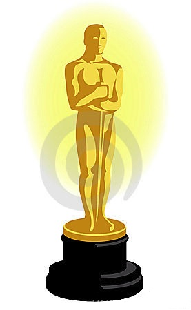

chRonos
========================================================





Some code to pull data related to movies and the start
of some code to buils some temporal models around it.


```r
require(devtools)
install_github("chRonos", "darrkj", quiet = TRUE)
library(chRonos)
data(mvData)
title <- "Avatar"
movie <- mvData[mvData$name == title, ]
a.Date <- zoo(movie$Daily, movie$date)
cal.heatMap(a.Date)
```


